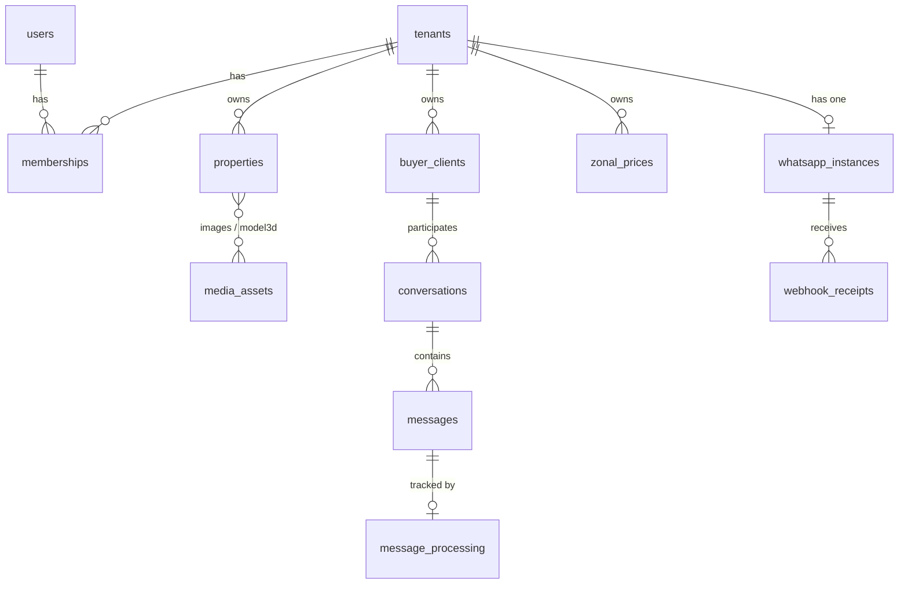

# Imno Agente — Product & Technical Specification

> Working specification inferred from the Payload CMS schema, the access layer and
> the runtime configuration. Sections marked **(planned)** describe behaviour the
> data model clearly anticipates but that is not implemented yet.

---

## 1. What this product is

Imno Agente is a **multi-tenant AI sales assistant for real estate agencies**.

Each agency (a _tenant_) gets:

- A **property catalogue** with photos, 3D models and zone-based pricing.
- A **lead CRM** for buyer clients, qualified into `Cold` / `Warm` / `Hot`.
- An **AI agent** that converses with buyers over **WhatsApp** or a **public web
  chat widget**, answers questions about listings, and captures leads.
- **Human takeover**: any conversation can be paused so a human agent replies
  instead of the bot.
- **Content generation (planned)**: social copy and short vertical video
  (9:16) rendered from listing media.

The default market is **Spain**: tenants default to `countryCode: 'ES'`, prices to
`EUR`, and the content language to `es`. Pricing units cover both sale and rental
(`total`, `per_sqm`, `per_month`).

### Primary users

| Role              | Uses                                                                     |
| ----------------- | ------------------------------------------------------------------------ |
| Agency owner      | Signs up, creates the tenant, connects WhatsApp, invites members         |
| Agency member     | Manages listings and leads, reads conversations, takes over from the bot |
| Buyer (anonymous) | Chats via WhatsApp or the public `/chat/:publicChatKey` widget           |

---

## 2. Architecture

```
┌────────────────┐        ┌──────────────────────┐        ┌─────────────────┐
│ apps/frontend  │  BFF   │ apps/api             │  HMAC  │ apps/agent      │
│ Next 15 :3000  ├───────►│ Next 15 + Payload    ├───────►│ Mastra worker   │
│ (browser)      │  REST  │ :3001                │        │ :3002           │
└────────────────┘        └──────────┬───────────┘        └────────┬────────┘
                                     │                             │
                          ┌──────────┴──────────┐          ┌───────┴───────┐
                          │ Cloudflare D1 (SQL) │          │ LLM provider  │
                          │ Cloudflare R2 (obj) │          │ (DeepSeek)    │
                          └─────────────────────┘          └───────────────┘
                                     ▲
                          ┌──────────┴──────────┐
                          │ Evolution API :8081 │  ← WhatsApp gateway
                          │ + Postgres + Redis  │    (docker compose)
                          └─────────────────────┘
```

### Boundaries

- **The browser never talks to Payload directly.** `apps/frontend` exposes a
  same-origin BFF under `/api/*`; those route handlers forward the
  `payload-token` cookie to `apps/api`. This keeps the CMS origin private and
  avoids CORS/cookie problems.
- **`apps/api`** owns all persistence. Payload is the single writer to D1/R2.
- **`apps/agent`** is stateless w.r.t. business data; it calls back into the API
  with `INTERNAL_SERVICE_SECRET`.
- **Framework-neutral packages** (`contracts`, `domain`, `*-core`,
  `runtime-config`) must not import Next, React, Payload, Mastra or any
  `integration-*` package. ESLint enforces this.

### Stack

| Layer          | Choice                                                      |
| -------------- | ----------------------------------------------------------- |
| Monorepo       | Nx 21 + pnpm 10 workspaces                                  |
| CMS / API      | Payload 3.86 on Next 15 (App Router)                        |
| Database       | Cloudflare D1 (SQLite) via `@payloadcms/db-d1-sqlite`       |
| Object storage | Cloudflare R2 via `@payloadcms/storage-r2`                  |
| Rich text      | Lexical (configured; no `richText` field uses it yet)       |
| Frontend       | Next 15 App Router, React 19, Tailwind v4                   |
| Agent runtime  | Mastra (`@mastra/core`, `@mastra/memory`, `@mastra/libsql`) |
| WhatsApp       | Evolution API v2.3.7                                        |
| IDs            | `number` — D1 auto-increment integers, not UUIDs            |

---

## 3. Tenancy and authorisation

Every collection except `users` carries a `tenant` relationship. Isolation is
enforced in three layers:

1. **Read/update/delete** return a Payload `where` constraint rather than a
   boolean, so foreign rows are _not found_ instead of _forbidden_ — the API
   never discloses that another tenant's record exists.
2. **Create** is open to any authenticated user, but the `tenant` field is
   overwritten server-side by a field hook. A browser-supplied `tenant` is
   ignored unless it is one of the caller's memberships.
3. A collection-level `beforeChange` guard throws `TENANT_FORBIDDEN` as defence
   in depth.

```ts
// apps/api/src/access/tenant-access.ts
export function tenantScopedAccess(tenantField = 'tenant'): Access {
  return async ({ req }) => {
    if (!req.user) return true // server-side seed/internal reads
    const ids = await membershipTenantIds(req)
    if (ids.length === 0) return false
    return { [tenantField]: { in: ids } } as ReturnType<Access>
  }
}
```

Creating a tenant automatically creates an `owner` membership for the creator
(`ensureTenantOwner`, an `afterChange` hook), so signup is a single write.

The standard shape shared by every tenant-scoped collection:

```ts
{
  name: 'tenant',
  type: 'relationship',
  relationTo: 'tenants',
  required: true,
  index: true,
  hooks: { beforeChange: [assignTenantFieldHook] },
  admin: { readOnly: true },
}
```

---

## 4. Data model



### 4.1 `tenants`

An agency workspace. `publicChatKey` is the unguessable identifier used in the
public widget URL (`/chat/:publicChatKey`), so it is separate from the
human-readable `slug` used in dashboard URLs. `allowedOrigins` whitelists sites
that may embed the widget.

| Field            | Type   | Notes                           |
| ---------------- | ------ | ------------------------------- |
| `slug`           | text   | required, unique, indexed       |
| `name`           | text   | required                        |
| `countryCode`    | text   | required, default `ES`          |
| `publicChatKey`  | text   | required, unique, indexed       |
| `allowedOrigins` | text[] | CORS allowlist for the web chat |

### 4.2 `users` / `memberships`

`users` is the Payload auth collection (email + password, `useAsTitle: 'email'`)
with one extra `displayName` field. Membership is a join row so a user can belong
to several agencies.

| Field    | Type            | Notes                                 |
| -------- | --------------- | ------------------------------------- |
| `user`   | rel → `users`   | required                              |
| `tenant` | rel → `tenants` | required, indexed                     |
| `role`   | select          | `owner` \| `member`, default `member` |

Unique on `[user, tenant]`.

### 4.3 `properties` — the core listing

```ts
export const Properties: CollectionConfig = {
  slug: 'properties',
  access: {
    read: tenantScopedAccess(),
    update: tenantScopedAccess(),
    delete: tenantScopedAccess(),
    create: authenticatedCreate,
  },
  hooks: { beforeChange: [assertTenantMembership()] },
  fields: [
    /* tenant: see §3 */
    { name: 'reference', type: 'text', required: true },
    { name: 'title', type: 'text', required: true },
    { name: 'description', type: 'textarea' },
    { name: 'price', type: 'number', required: true },
    { name: 'currency', type: 'text', required: true, defaultValue: 'EUR' },
    { name: 'zone', type: 'text', required: true, index: true },
    {
      name: 'pricingUnit',
      type: 'select',
      options: ['per_sqm', 'total', 'per_month'],
      required: true,
      defaultValue: 'total',
    },
    {
      name: 'status',
      type: 'select',
      options: ['available', 'reserved', 'sold'],
      required: true,
      defaultValue: 'available',
    },
    { name: 'images', type: 'relationship', relationTo: 'media-assets', hasMany: true },
    { name: 'mainImage', type: 'relationship', relationTo: 'media-assets' },
    { name: 'model3d', type: 'relationship', relationTo: 'media-assets' },
    { name: 'bedrooms', type: 'number' },
    { name: 'bathrooms', type: 'number' },
    { name: 'areaSqm', type: 'number' },
  ],
}
```

Generated type:

```ts
export interface Property {
  id: number
  tenant: number | Tenant
  reference: string
  title: string
  description?: string | null
  price: number
  currency: string
  zone: string
  pricingUnit: 'per_sqm' | 'total' | 'per_month'
  status: 'available' | 'reserved' | 'sold'
  images?: (number | MediaAsset)[] | null
  mainImage?: (number | null) | MediaAsset
  model3d?: (number | null) | MediaAsset
  bedrooms?: number | null
  bathrooms?: number | null
  areaSqm?: number | null
  updatedAt: string
  createdAt: string
}
```

`zone` is a free-text, indexed string rather than a relationship — it is the join
key to `zonal-prices`, which lets an agency price by neighbourhood without
maintaining a geography table.

### 4.4 `zonal-prices`

Market benchmark per zone, used to show "this listing is X% above the zone
average" and to give the AI agent pricing context.

| Field         | Type   | Notes                               |
| ------------- | ------ | ----------------------------------- |
| `zone`        | text   | required, indexed                   |
| `pricingUnit` | select | `per_sqm` \| `total` \| `per_month` |
| `amount`      | number | required                            |
| `currency`    | text   | required, default `EUR`             |

Unique on `[tenant, zone, pricingUnit]`.

### 4.5 `buyer-clients` — leads

| Field             | Type   | Notes                                      |
| ----------------- | ------ | ------------------------------------------ |
| `name`            | text   | required                                   |
| `normalizedPhone` | text   | E.164, indexed — the WhatsApp identity key |
| `email`           | text   | optional                                   |
| `leadStatus`      | select | `Cold` \| `Warm` \| `Hot`, default `Cold`  |

Unique on `[tenant, normalizedPhone]`: the same phone number can be a lead for
two different agencies, but never twice within one.

### 4.6 `media-assets`

An R2-backed upload collection, the only one registered with the storage plugin.
`kind` discriminates the asset so the UI can pick the right renderer (gallery,
`<model-viewer>`, audio player, video).

| Field           | Type   | Notes                                                        |
| --------------- | ------ | ------------------------------------------------------------ |
| `kind`          | select | `image` \| `model-3d` \| `music` \| `video`, indexed         |
| _upload fields_ | —      | `filename`, `mimeType`, `filesize`, `width`, `height`, `url` |

Accepted MIME types: `image/*`, `model/gltf-binary`, `model/gltf+json`,
`audio/*`, `video/mp4`. GLTF/GLB support is what powers 3D property tours.

### 4.7 `conversations` / `messages`

```ts
// conversations
{ name: 'client',          type: 'relationship', relationTo: 'buyer-clients', required: true }
{ name: 'channel',         type: 'select', options: ['whatsapp', 'web-chat'], required: true }
{ name: 'channelThreadId', type: 'text', required: true, index: true }
{ name: 'botPaused',       type: 'checkbox', defaultValue: false }
```

Unique on `[tenant, channel, channelThreadId]` — one thread per buyer per
channel. `botPaused` is the human-takeover switch: when true the agent must not
auto-reply.

```ts
// messages
{ name: 'conversation',      type: 'relationship', relationTo: 'conversations', required: true, index: true }
{ name: 'direction',         type: 'select', options: ['inbound', 'outbound'], required: true }
{ name: 'author',            type: 'select', options: ['buyer', 'ai', 'human', 'system'], required: true }
{ name: 'text',              type: 'textarea', required: true }
{ name: 'providerMessageId', type: 'text', index: true }
{ name: 'idempotencyKey',    type: 'text', required: true, index: true }
{ name: 'processingState',   type: 'select', options: ['pending', 'processing', 'completed', 'failed', 'skipped'] }
{ name: 'deliveryState',     type: 'select', options: ['pending', 'sent', 'failed', 'unknown'] }
```

`direction` and `author` are deliberately independent: an outbound message may be
authored by `ai` or by a `human` who took over, and `system` covers notices that
were never sent to the buyer.

### 4.8 WhatsApp plumbing

**`whatsapp-instances`** — one Evolution instance per tenant (unique on
`[tenant]`, and `instanceName` unique globally). `connectionState` mirrors
Evolution's `open` / `connecting` / `close`, which drives the QR pairing UI.

**`webhook-receipts`** — an idempotency ledger. Unique on
`[instance, providerEventKey]`, so a webhook redelivery is a no-op insert
failure rather than a duplicated message.

**`message-processing`** — one row per inbound message (unique on
`inboundMessage`) with `state`, `attempts` and `safeError`. `safeError` is
explicitly "safe": provider payloads and PII must not leak into it.

Together these three give **at-least-once delivery with exactly-once effect**:

```
Evolution webhook
  → webhook-receipts insert (dedupe by providerEventKey)
    → messages insert (dedupe by idempotencyKey)
      → message-processing row (pending)
        → agent reply → outbound message (deliveryState: pending → sent)
```

---

## 5. API surface

### Payload built-ins (`apps/api`, port 3001)

| Route                                                    | Purpose                                       |
| -------------------------------------------------------- | --------------------------------------------- |
| `/admin`                                                 | Payload admin panel                           |
| `/api/:collection`                                       | REST CRUD, tenant-filtered by access rules    |
| `/api/users/login`, `/api/users/logout`, `/api/users/me` | Cookie auth (`payload-token`)                 |
| `/api/graphql`, `/api/graphql-playground`                | GraphQL                                       |
| `/api/health`                                            | `{ status: 'ok', service: 'api', timestamp }` |

REST query style used by the frontend:
`?where[tenant][equals]=3&where[name][like]=ana&depth=1&limit=50&sort=-createdAt`

### Planned API endpoints

| Route                            | Purpose                                                      |
| -------------------------------- | ------------------------------------------------------------ |
| `POST /api/webhooks/evolution`   | Inbound WhatsApp events (target of `EVOLUTION_WEBHOOK_URL`)  |
| `POST /api/public-chat`          | Widget message ingress, authenticated by `X-Internal-Secret` |
| `POST /api/content/render-video` | ffmpeg render job                                            |

### Frontend BFF (`apps/frontend`, port 3000)

| Route                                                    | Forwards to                                              |
| -------------------------------------------------------- | -------------------------------------------------------- |
| `/api/auth/login`, `/logout`, `/me`                      | Payload auth; bridges `payload-token` into a Next cookie |
| `/api/properties`, `/api/properties/[id]`                | Payload `properties`                                     |
| `/api/buyer-clients`, `/api/buyer-clients/[id]`          | Payload `buyer-clients`                                  |
| `/api/messages`                                          | Payload `messages`                                       |
| `/api/media-assets`, `/api/media-assets/file/[filename]` | Payload uploads + a streaming file proxy                 |
| `/api/zonal-prices`                                      | Payload `zonal-prices`                                   |
| `/api/public-chat`                                       | API public chat, adds the internal secret                |
| `/api/content/generate-copy`                             | Agent worker                                             |
| `/api/content/render-video`                              | API render job                                           |
| `/api/whatsapp/ensure-instance`, `/qr`, `/status`        | Evolution API + `whatsapp-instances`                     |

---

## 6. Frontend surface

Spanish-only UI (`<html lang="es">`); there is no locale routing, and Payload
localization is intentionally off — content is single-language per tenant, driven
by `CONTENT_DEFAULT_LANGUAGE`.

| Route                                     | Purpose                                     |
| ----------------------------------------- | ------------------------------------------- |
| `/`                                       | Marketing landing                           |
| `/login`                                  | Email + password                            |
| `/chat/[publicKey]`                       | Public buyer chat widget                    |
| `/app/[tenantSlug]`                       | Redirects to properties                     |
| `/app/[tenantSlug]/properties`            | Catalogue grid                              |
| `/app/[tenantSlug]/properties/new`        | Create listing with media upload            |
| `/app/[tenantSlug]/properties/[id]`       | Detail, 3D viewer, zone price comparison    |
| `/app/[tenantSlug]/clients`               | Lead list — table or kanban by `leadStatus` |
| `/app/[tenantSlug]/clients/new`           | Create lead                                 |
| `/app/[tenantSlug]/clients/[id]`          | Lead detail with conversation history       |
| `/app/[tenantSlug]/conversations`         | All conversations                           |
| `/app/[tenantSlug]/content`               | AI copy and video generation                |
| `/app/[tenantSlug]/settings/integrations` | WhatsApp QR pairing                         |

The tenant layout is the authorisation boundary: it resolves the session, checks
that the user has a membership for `[tenantSlug]`, and 404s/redirects otherwise.

Styling is a hand-written component layer on Tailwind v4 (`@theme` tokens plus
`@layer components`) — semantic classes like `.btn`, `.card`, `.badge`,
`.sidebar-*`. No component library, no dark mode. Brand colour is green
(`#039855`), typeface Inter.

---

## 7. Configuration

All server-only values; nothing sensitive may carry a `NEXT_PUBLIC_` prefix.

| Variable                     | Default                                                   | Purpose                                    |
| ---------------------------- | --------------------------------------------------------- | ------------------------------------------ |
| `APP_URL`                    | `http://localhost:3000`                                   | Frontend origin                            |
| `API_URL`                    | `http://localhost:3001`                                   | Payload/API origin                         |
| `AGENT_INTERNAL_URL`         | `http://localhost:3002`                                   | Agent worker                               |
| `INTERNAL_SERVICE_SECRET`    | —                                                         | Shared secret for service-to-service calls |
| `PAYLOAD_SECRET`             | —                                                         | Payload auth/crypto                        |
| `CLOUDFLARE_ENV`             | `local`                                                   | Cloudflare environment                     |
| `CLOUDFLARE_D1_BINDING`      | `D1`                                                      | D1 binding name                            |
| `CLOUDFLARE_R2_BINDING`      | `R2`                                                      | R2 binding name                            |
| `EVOLUTION_BASE_URL`         | `http://localhost:8081`                                   | Evolution API (internal)                   |
| `EVOLUTION_PUBLIC_URL`       | `http://localhost:8081`                                   | Evolution API (public)                     |
| `EVOLUTION_API_KEY`          | —                                                         | Evolution auth                             |
| `EVOLUTION_INSTANCE_PREFIX`  | `imno-agent`                                              | Instance naming prefix                     |
| `EVOLUTION_WEBHOOK_SECRET`   | —                                                         | Webhook verification                       |
| `EVOLUTION_WEBHOOK_URL`      | `http://host.docker.internal:3001/api/webhooks/evolution` | Callback target                            |
| `LLM_ADAPTER`                | `default`                                                 | Provider selector                          |
| `LLM_API_KEY`                | —                                                         | Model key                                  |
| `LLM_MODEL`                  | `deepseek-chat`                                           | Model name                                 |
| `LLM_BASE_URL`               | `https://api.deepseek.com`                                | Model endpoint                             |
| `CONTENT_DEFAULT_LANGUAGE`   | `es`                                                      | Generated content language                 |
| `VIDEO_FFMPEG_PATH`          | `ffmpeg`                                                  | ffmpeg binary                              |
| `VIDEO_TEMP_DIR`             | `.tmp/video`                                              | Scratch dir                                |
| `VIDEO_DEFAULT_ASPECT_RATIO` | `9:16`                                                    | Vertical/reels default                     |
| `TRANSCRIPTION_PROVIDER`     | `unsupported`                                             | Deferred                                   |
| `VOICE_PROVIDER`             | `unsupported`                                             | Deferred                                   |
| `IMAGE_ENHANCEMENT_PROVIDER` | `pass-through`                                            | Deferred                                   |

The deployed API runs on Cloudflare Workers, so D1 and R2 arrive as native
bindings and need no credentials. The two variables below only authenticate
wrangler's remote bindings, which is how the CLI scripts migrate and seed the
deployed database from outside a Worker (`CLOUDFLARE_ENV` other than `local`);
see `apps/api/src/cloudflare` and `DEPLOY.md`.

| Variable                | Default                               | Purpose                       |
| ----------------------- | ------------------------------------- | ----------------------------- |
| `CLOUDFLARE_ACCOUNT_ID` | —                                     | Account owning D1 and R2      |
| `CLOUDFLARE_API_TOKEN`  | —                                     | Token with D1 edit permission |
| `MASTRA_STORAGE_URL`    | `file:<repo>/.mastra/agent-memory.db` | Agent thread store            |
| `PORT`                  | —                                     | Overrides the listening port  |

Providers are **named, not hardcoded**: `unsupported` and `pass-through` are
valid values, so a missing capability fails predictably instead of crashing.

Local D1 and R2 are served by Wrangler's platform proxy; state lives in
`apps/api/.wrangler`. Evolution runs in Docker with its own Postgres and Redis,
which are private to Evolution and not application storage.

---

## 8. Package responsibilities

| Package                          | Responsibility                       | Status                      |
| -------------------------------- | ------------------------------------ | --------------------------- |
| `apps/frontend`                  | Next app + BFF, port 3000            | implemented                 |
| `apps/api`                       | Payload CMS, REST/GraphQL, port 3001 | schema + access implemented |
| `apps/agent`                     | Mastra worker, port 3002             | placeholder                 |
| `packages/contracts`             | Zod schemas and shared DTOs          | scaffold                    |
| `packages/domain`                | Entities, value objects, invariants  | scaffold                    |
| `packages/agent-core`            | Conversation/agent use cases         | scaffold                    |
| `packages/content-core`          | Copy and video generation use cases  | scaffold                    |
| `packages/runtime-config`        | Env parsing and validation           | scaffold                    |
| `packages/integration-evolution` | Evolution API adapter                | scaffold                    |
| `packages/integration-llm`       | LLM adapter                          | scaffold                    |
| `packages/integration-ffmpeg`    | Video rendering adapter              | scaffold                    |
| `packages/test-support`          | Fixtures and builders                | scaffold                    |

Packages are consumed as **source** through `@imno/*` aliases in
`tsconfig.base.json`; there is no build step between them.

### Expected shapes for the scaffolded packages

```ts
// packages/contracts — the wire contract, shared by API, agent and BFF
export const LeadStatus = z.enum(['Cold', 'Warm', 'Hot'])
export const PricingUnit = z.enum(['per_sqm', 'total', 'per_month'])

export const PropertySchema = z.object({
  id: z.number(),
  reference: z.string().min(1),
  title: z.string().min(1),
  price: z.number().positive(),
  currency: z.string().length(3),
  zone: z.string().min(1),
  pricingUnit: PricingUnit,
  status: z.enum(['available', 'reserved', 'sold']),
})
export type PropertyDto = z.infer<typeof PropertySchema>

export const InboundMessageSchema = z.object({
  tenantId: z.number(),
  channel: z.enum(['whatsapp', 'web-chat']),
  channelThreadId: z.string().min(1),
  text: z.string().min(1),
  idempotencyKey: z.string().min(1),
  providerMessageId: z.string().optional(),
})
```

```ts
// packages/domain — invariants that must not depend on Payload
export type Money = { amount: number; currency: string }

export function comparePriceToZone(
  listing: { price: number; areaSqm?: number | null; pricingUnit: PricingUnit },
  benchmark: { amount: number; pricingUnit: PricingUnit },
): { deltaRatio: number } | null

export function normalizePhone(raw: string, countryCode: string): string | null
```

```ts
// packages/agent-core — ports in, adapters out
export interface ConversationRepository {
  findOrCreate(input: {
    tenantId: number
    channel: Channel
    channelThreadId: string
  }): Promise<Conversation>
  appendMessage(input: NewMessage): Promise<Message>
}

export interface LlmPort {
  reply(input: { history: Message[]; listings: PropertyDto[] }): Promise<string>
}

export async function handleInboundMessage(
  deps: { conversations: ConversationRepository; llm: LlmPort },
  input: InboundMessage,
): Promise<{ outbound?: NewMessage; skipped?: 'bot_paused' | 'duplicate' }>
```

---

## 9. Conventions and invariants

1. **The tenant field is never trusted from the client.** It is assigned by a
   field hook and re-checked by a collection hook.
2. **Cross-tenant reads return "not found", not "forbidden."**
3. **Every inbound message path is idempotent**, keyed on
   `webhook-receipts.providerEventKey` and `messages.idempotencyKey`.
4. **The browser talks only to the BFF**, never to Payload directly.
5. **Framework-neutral packages stay framework-neutral** (ESLint-enforced).
6. **IDs are numbers** (D1 autoincrement) — do not assume UUID strings.
7. **Schema changes are migrations**: `pnpm db:migrate:create` →
   `pnpm db:setup` → `pnpm generate:types`.
8. **`.env` is gitignored**; `.env.sample` is the contract and must stay in sync.
9. **`safeError` fields carry no PII or provider payloads.**

---

## 10. Roadmap

**Now** — Payload schema, tenant isolation, migrations, frontend dashboard and BFF.

**Next**

- `POST /api/webhooks/evolution` with receipt-based deduplication.
- Mastra agent: retrieval over `properties` + `zonal-prices`, reply generation,
  respect for `botPaused`.
- `POST /api/public-chat` with `allowedOrigins` enforcement.
- Fill in `contracts` / `domain` / `runtime-config` so validation is shared
  rather than duplicated per app.
- Property edit page (the detail view already links to it).

**Later**

- ffmpeg vertical video rendering from listing media.
- Voice notes: transcription in, synthesis out.
- Image enhancement beyond `pass-through`.
- Member invitations and role-based permissions past `owner` / `member`.
- Deploy to Cloudflare Workers with real D1/R2 bindings.
